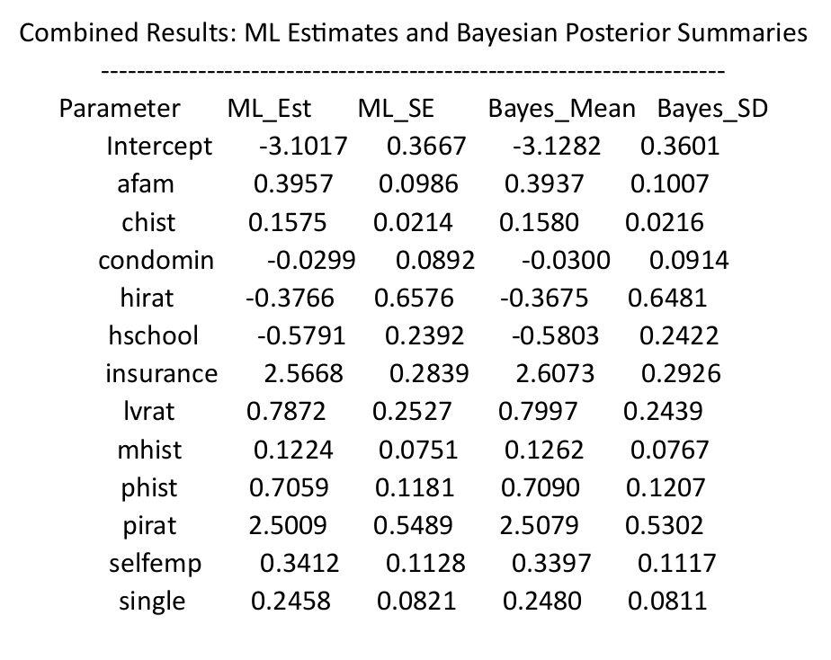

# Bayesian-Estimation-of-Probit-Model
Consider the file “hmda.xlsx”, where the
data is present in the sheet “data” and variable description in the sheet “desc”. This is a
cross section data from the Home Mortgage Disclosure Act (HMDA) pertaining to mortgage
applications made in 1990 in the greater Boston metropolitan area.
Our objective is to model the probability of loan denial (i.e., y =1 if deny = yes, and 0
otherwise) as a function of the intercept and remaining variables in the file. Note that the
following covariates are categorical/binary: chist, mhist, phist, selfemp, insurance,
condomin, afam, single, and hschool

RESULTS

